# Coursework 2 Report

## Data-Driven and Learning-Based Methods in Mechanics and Materials

This report covers both coursework problems:

1. solving a linear-elastic boundary value problem with a physics-informed neural network (PINN), and
2. learning the Darcy flow solution operator with convolutional and Fourier neural architectures.

The report is organised primarily by problem so that each coursework prompt can be matched directly to a corresponding subsection. The emphasis throughout is not only on final error values, but also on training behaviour, graphical evidence, hyperparameter tuning, and the numerical issues that materially affected the results. In particular, two practical lessons emerged during the project:

- for the PINN, low internal residual loss did not guarantee good agreement with the FEM reference solution, and
- for the Fourier Neural Operator (FNO), backend and precision choices materially changed the quality of the final result.

## Problem 1: PINN for the Plate-With-Hole Problem

### Problem 1 Introduction

The first problem is to solve a two-dimensional linear elasticity boundary value problem using a physics-informed neural network. The geometry is a quarter plate with a circular hole, exploiting symmetry so that only one quadrant needs to be modeled. This is a classical stress-concentration problem, and it is challenging for a PINN for two reasons. First, the solution must satisfy several coupled constraints simultaneously: equilibrium, constitutive consistency, symmetry conditions, prescribed tractions, and traction-free conditions on the hole boundary. Second, even when the PINN satisfies its own residual-based objective very well, that does not automatically mean it agrees with the finite element reference solution supplied by the coursework MATLAB code. For that reason, the FEM solution is used here as an external ground truth for validation rather than relying only on the internal PINN loss.

### Governing Equations and Boundary Conditions

The coursework considers a plane-stress linear elastic problem with Young's modulus

$$
E = 10
$$

and Poisson ratio

$$
\nu = 0.3.
$$

There are no body forces, so the governing equilibrium equations are

$$
\frac{\partial \sigma_{11}}{\partial x} + \frac{\partial \sigma_{12}}{\partial y} = 0,
$$

$$
\frac{\partial \sigma_{12}}{\partial x} + \frac{\partial \sigma_{22}}{\partial y} = 0.
$$

The strain-displacement relation is

$$
\varepsilon_{11} = \frac{\partial u}{\partial x}, \qquad
\varepsilon_{22} = \frac{\partial v}{\partial y}, \qquad
\gamma_{12} = \frac{\partial u}{\partial y} + \frac{\partial v}{\partial x},
$$

where engineering shear strain is used so that the constitutive model matches the FEM reference implementation in `Plate_hole.m`.

Under plane stress, the constitutive relation is

$$
\begin{bmatrix}
\sigma_{11} \\
\sigma_{22} \\
\sigma_{12}
\end{bmatrix}
=
\mathbf{D}
\begin{bmatrix}
\varepsilon_{11} \\
\varepsilon_{22} \\
\gamma_{12}
\end{bmatrix},
$$

with

$$
\mathbf{D}
=
\frac{E}{1-\nu^2}
\begin{bmatrix}
1 & \nu & 0 \\
\nu & 1 & 0 \\
0 & 0 & \frac{1-\nu}{2}
\end{bmatrix}.
$$

The boundary conditions for the quarter-domain are:

- left edge: symmetry condition \(u = 0\),
- bottom edge: symmetry condition \(v = 0\),
- right edge: applied traction \((\sigma_{11}, \sigma_{12}) = (0.1, 0)\),
- top edge: applied traction \((\sigma_{12}, \sigma_{22}) = (0, 0)\),
- hole boundary: traction free, so \(\boldsymbol{\sigma}\mathbf{n} = \mathbf{0}\).

Only a quarter of the plate is modeled because the geometry and loading are symmetric. This reduces the computational domain while retaining the essential local stress concentration around the hole.

### PINN Loss Function

The PINN loss was defined as a weighted sum of physically motivated terms:

$$
\mathcal{L}
=
w_{\mathrm{eq}} \mathcal{L}_{\mathrm{eq}}
+ w_{\mathrm{cons}} \mathcal{L}_{\mathrm{cons}}
+ w_{\mathrm{bc}} \mathcal{L}_{\mathrm{bc}}
+ w_{\mathrm{cons,bc}} \mathcal{L}_{\mathrm{cons,bc}}
+ w_{\mathrm{data}} \mathcal{L}_{\mathrm{data}}.
$$

The individual components were:

- **equilibrium loss** \(\mathcal{L}_{\mathrm{eq}}\): penalises violation of the two stress-equilibrium equations at the interior collocation points,
- **constitutive loss** \(\mathcal{L}_{\mathrm{cons}}\): forces the learned stress field to agree with the constitutive stress computed from the learned displacement field in the interior,
- **boundary loss** \(\mathcal{L}_{\mathrm{bc}}\): enforces the essential and traction boundary conditions,
- **boundary constitutive loss** \(\mathcal{L}_{\mathrm{cons,bc}}\): enforces stress-displacement constitutive consistency on the boundary,
- **data loss** \(\mathcal{L}_{\mathrm{data}}\): only used in part (e), penalising mismatch between the predicted displacement and the supplied measurements at 50 interior points.

All terms were implemented using mean-squared error losses. This formulation follows the coursework skeleton closely, but it also makes a central limitation of PINNs visible: a low composite residual does not necessarily imply accurate reconstruction of the true solution. That limitation became very clear in the physics-only results.

### PINN Architecture and Training Setup

The PINN used two separate fully connected neural networks:

- a **displacement network** mapping \((x, y)\) to \((u, v)\), and
- a **stress network** mapping \((x, y)\) to \((\sigma_{11}, \sigma_{22}, \sigma_{12})\).

This two-network structure was retained from the coursework skeleton because it allows displacement and stress to be learned simultaneously while constraining them through the constitutive relation. In effect, the displacement network provides a kinematically admissible field, while the stress network provides a statically admissible field, and the constitutive losses couple the two.

The main implementation correction required during the project was to make the engineering shear convention consistent everywhere. Initially, the strain definition mixed tensorial and engineering shear conventions, which made the constitutive relation inconsistent with the FEM reference. That inconsistency affected the training loss, the final stress reconstruction, and the stress comparison with FEM. After correcting this so that \(\gamma_{12} = \partial u/\partial y + \partial v/\partial x\) was used consistently throughout, the PINN results became physically interpretable.

The training loop also saved the best model checkpoint according to the lowest tracked loss during the PINN runs. This did not perform early stopping, but it ensured that the final post-processing could use the best checkpoint rather than the final state if late-stage drift occurred.

For the final reported runs, the PINNs were executed on CPU in double precision. Earlier experiments on MPS in float32 were useful for tuning, but the final comparisons against FEM were carried out with the more numerically reliable float64/CPU setting.

### Hyperparameter Tuning Strategy

Hyperparameter tuning was a substantial part of Problem 1 because the PINN was sensitive to both optimization settings and the weighting of the loss components. The tuning workflow had several stages:

1. short manual smoke tests to confirm the formulation and device behaviour,
2. Optuna studies for the baseline physics-only problem and the data-assisted part (e) problem,
3. fast proxy tuning on MPS in float32,
4. explicit reruns of the best trials in float32 and float64,
5. final long runs in float64 on CPU.

The Optuna search space for the baseline study was:

| Hyperparameter | Search space |
|---|---|
| `learning_rate` | \(10^{-4}\) to \(3\times10^{-3}\), log scale |
| `disp_width` | 200, 300, 400 |
| `stress_width` | 300, 400, 500 |
| `scheduler` | `none`, `step` |
| `lr_gamma` | 0.30 to 0.70 |
| `lr_step_size` | 2000, 4000, 6000 |
| `w_bc` | 0.5, 1.0, 2.0, 5.0 |
| `w_cons_bc` | 0.5, 1.0, 2.0 |

For the part (e) study, the same space was used with the addition of:

| Hyperparameter | Search space |
|---|---|
| `w_data` | 10 to 1000, log scale |

The proxy tuning stage was deliberately run on MPS in float32 because it was substantially faster than CPU float64. Empirically, this gave roughly a threefold reduction in run time for short PINN experiments and therefore made it feasible to screen many more configurations than would have been practical in float64. However, the rerun comparisons showed that float32 results could not simply be trusted as final. In the baseline study, the mean absolute gap between float32 and float64 objective values over the rerun set was about 0.288, with one trial differing by over 1.0 in displacement relative \(L_2\) error. In the part (e) study the average absolute gap was smaller, about 0.080, but still large enough to affect ranking.

The most relevant tuning plots are embedded below.

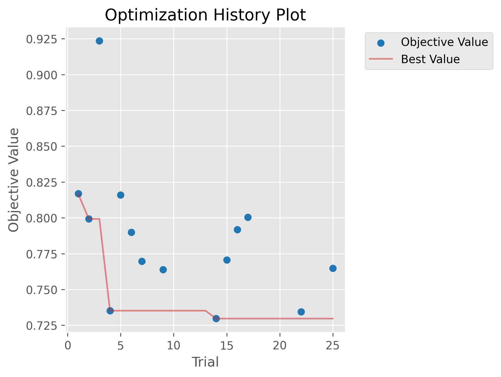

*Figure 1. Baseline Optuna optimization history. This plot shows how the objective improved as more trials were explored. The important point is not only that the objective decreased, but that the gains plateaued relatively early, suggesting the baseline physics-only formulation was fundamentally limited rather than merely under-tuned.*

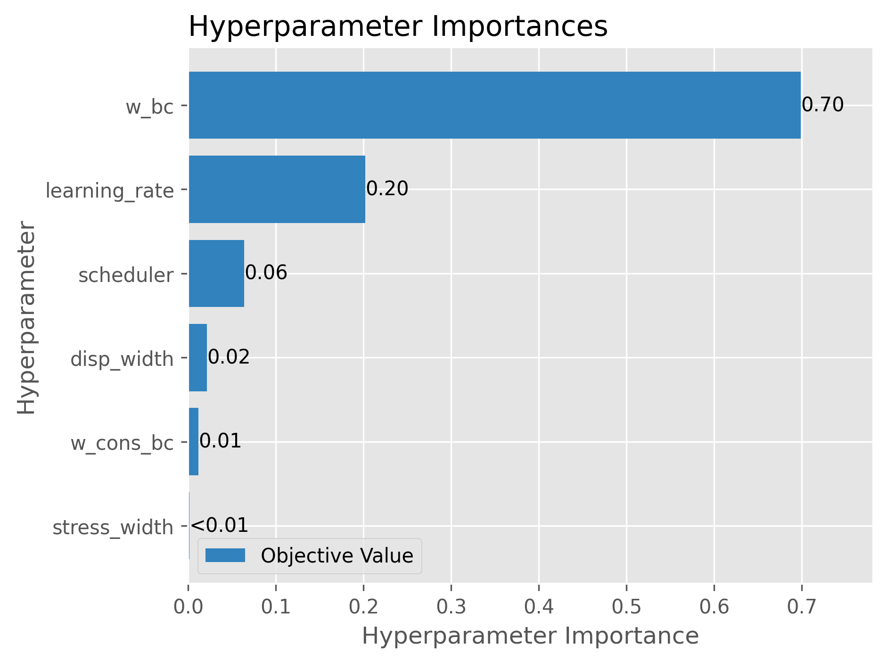

*Figure 2. Baseline Optuna hyperparameter importance. This plot was used together with the top-trial table to identify which design choices mattered most. In practice, it supported the observation that large displacement-network widths and loss weighting choices were more influential than adding a scheduler.*

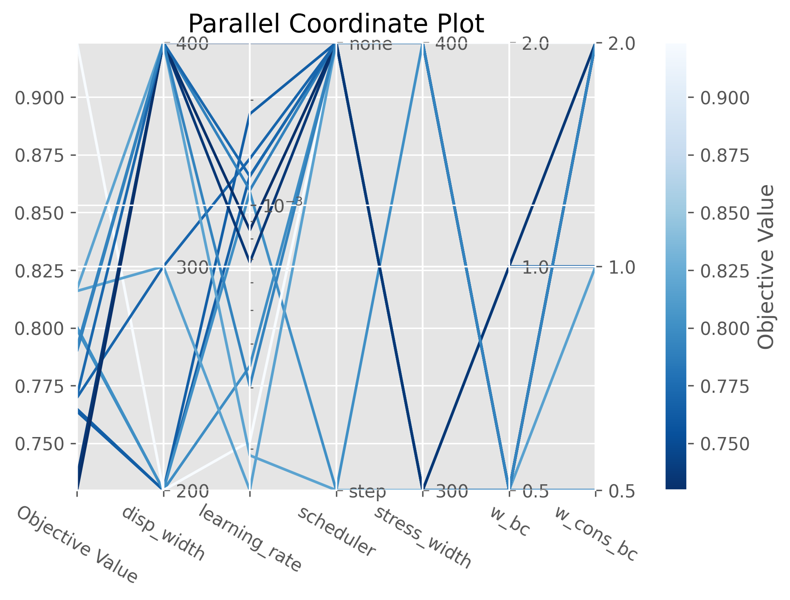

*Figure 3. Baseline Optuna parallel coordinate plot. This figure makes interactions between hyperparameters visible. The best baseline trials consistently preferred `scheduler = none`, `disp_width = 400`, and high `w_cons_bc`, suggesting that direct loss balancing was more useful than stepped learning-rate decay in the short proxy budget.*

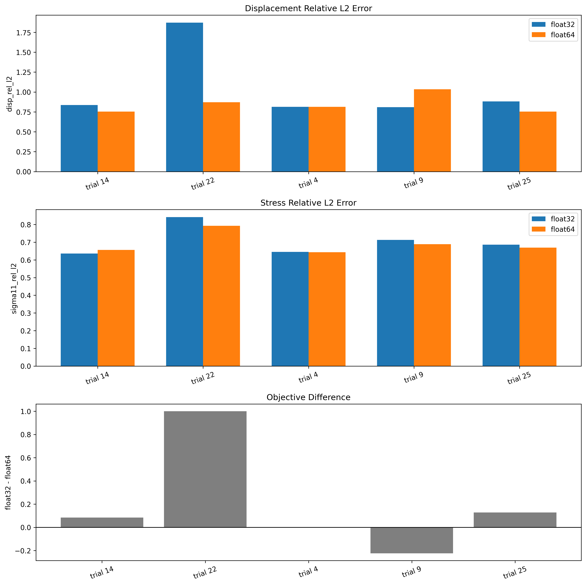

*Figure 4. Baseline rerun comparison between float32/MPS and float64/CPU. This was one of the most important practical plots of the project. It showed that float32/MPS was good enough for screening but not reliable enough for final baseline model selection.*

For the baseline study, the top five completed trials all used `scheduler = none`, which indicates that the stepped learning-rate schedule was not especially helpful under the short tuning budget. The best raw study trial used

- `learning_rate = 8.48e-4`,
- `disp_width = 400`,
- `stress_width = 400`,
- `scheduler = none`,
- `w_bc = 0.5`,
- `w_cons_bc = 2.0`.

The rerun analysis showed that the same configuration improved when moved from float32/MPS to float64/CPU, but it still remained a weak model in absolute terms.

The part (e) study told a different story. Its best trial also preferred no scheduler, but the loss weights became much more important:

- `learning_rate = 2.25e-4`,
- `disp_width = 200`,
- `stress_width = 400`,
- `scheduler = none`,
- `w_bc = 5.0`,
- `w_cons_bc = 2.0`,
- `w_data = 884.24`.

This result is physically plausible. Once measurement data were included, stronger boundary weighting and a large data-loss weight became useful because the model had to reconcile the PDE constraints with direct displacement targets.

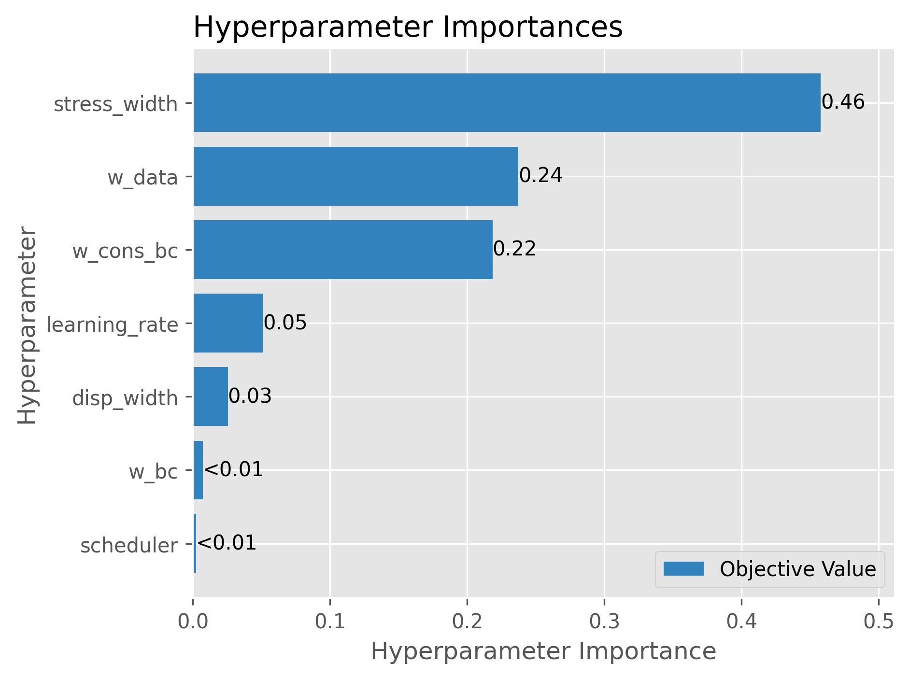

*Figure 5. Part (e) Optuna hyperparameter importance. The plot was used to identify which parameters most strongly affected the data-assisted objective. In practice, the combination of data weight, boundary weight, and learning rate was central, while scheduler choice again played a smaller role.*

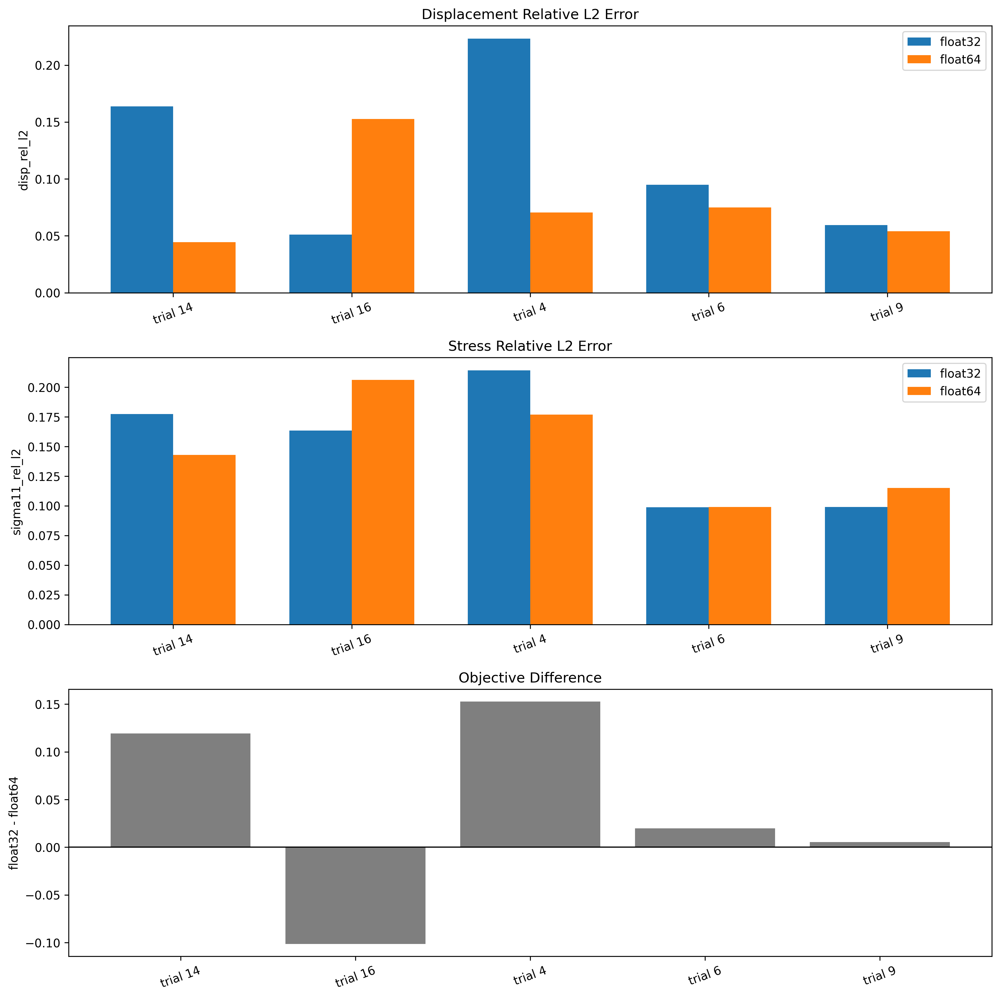

*Figure 6. Part (e) rerun comparison between float32/MPS and float64/CPU. The best trial under float32 did not necessarily remain best under float64, which justified using float32 only for screening and reserving float64/CPU for the final reported runs.*

Overall, the tuning process led to two conclusions:

- the physics-only PINN remained hard to make accurate even after systematic tuning, and
- the data-assisted PINN benefited strongly from careful loss weighting and from validating shortlisted trials in float64.

### Physics-Only PINN Results

The canonical physics-only final run was `problem1_20260315_165315_full_nodata_seed1234`, trained for 100,000 epochs on CPU. Its best tracked training loss was \(2.75\times10^{-6}\), reached at epoch 75,096. On its own terms, this looks like a successful optimization. However, the FEM comparison shows that the model was not actually accurate enough.

The key quantitative metrics were:

| Metric | Physics-only PINN |
|---|---:|
| Best training loss | \(2.75\times10^{-6}\) |
| Displacement RMSE | 0.01709 |
| Displacement relative \(L_2\) | 0.84411 |
| \(u\) relative \(L_2\) | 0.74376 |
| \(v\) relative \(L_2\) | 1.40221 |
| \(\sigma_{11}\) relative \(L_2\) | 0.67764 |
| \(\sigma_{22}\) relative \(L_2\) | 1.64342 |
| \(\sigma_{12}\) relative \(L_2\) | 1.06227 |

These values are too large to claim that the physics-only PINN had recovered the FEM solution well. In particular, the displacement error remained high and the \(\sigma_{22}\) and \(\sigma_{12}\) stress components were poor.

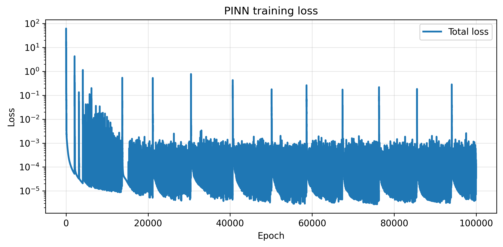

*Figure 7. Physics-only PINN training loss. The loss decreases convincingly, but this alone is misleading: low composite residual does not imply external agreement with FEM.*

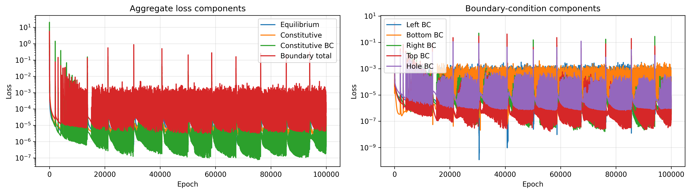

*Figure 8. Physics-only PINN loss components. The component losses show that equilibrium, constitutive consistency, and boundary conditions are all being enforced numerically. The important lesson is that satisfying these internal objectives still left a large gap to the FEM displacement and stress fields.*

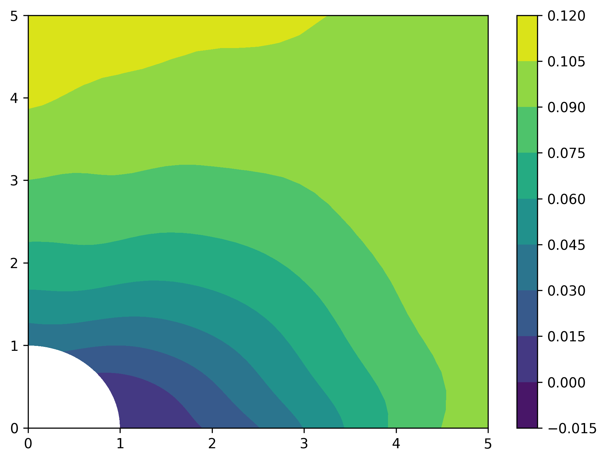

*Figure 9. Physics-only PINN tensile stress field \(\sigma_{11}\). The plot looks physically plausible at a glance because it shows a stress concentration around the hole. However, this visual plausibility is not enough: the FEM comparison reveals that the magnitude and detailed distribution are still inaccurate.*

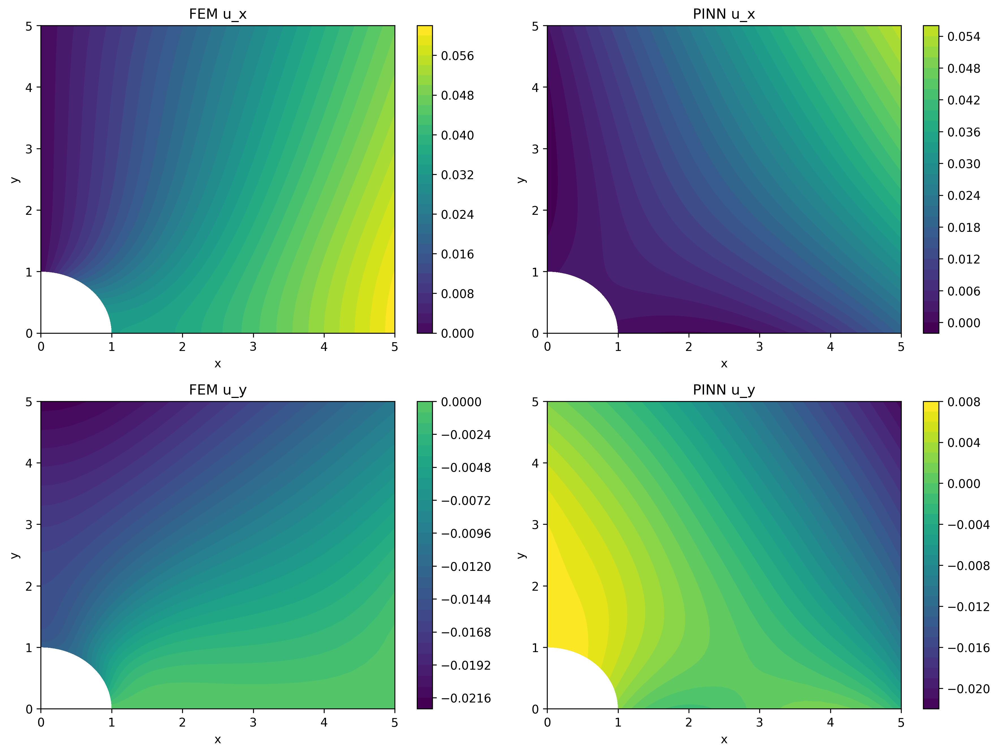

*Figure 10. Physics-only FEM-vs-PINN displacement comparison. The predicted displacement field captures the broad deformation pattern, but the mismatch remains substantial across the domain, which is consistent with the high relative \(L_2\) error.*

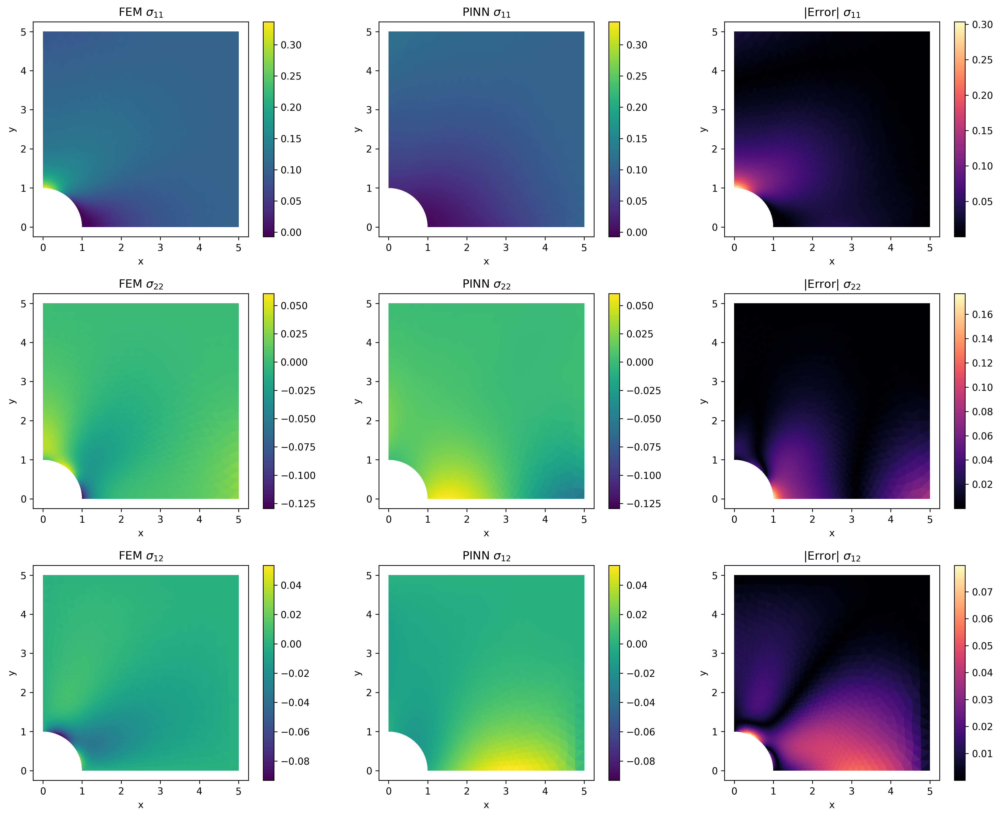

*Figure 11. Physics-only FEM-vs-PINN stress comparison. The comparison is especially useful because it shows that internal constitutive consistency is not the same as matching the FEM stress field. The \(\sigma_{11}\) component is partially captured, but \(\sigma_{22}\) and \(\sigma_{12}\) remain weak.*

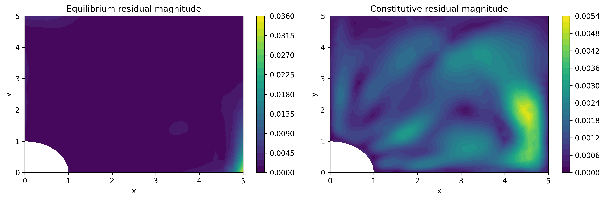

*Figure 12. Physics-only residual spatial maps. These maps help explain where the model is struggling. They suggest that the hardest regions are the geometrically and mechanically demanding parts of the domain, particularly around the hole boundary where the stress concentration is strongest.*

Taken together, the no-data results show a central limitation of the PINN approach in this problem. The model did learn to satisfy its internal equilibrium, constitutive, and boundary objectives. However, that did not translate into accurate reproduction of the FEM reference solution. The physics-only residual minimization therefore has to be judged as an informative but unsatisfactory solution.

### Data-Assisted PINN Results

The canonical data-assisted run was `problem1_20260315_203703_full_data_seed1234`, trained for 50,000 epochs on CPU with the 50 supplied displacement measurements included in the loss. Its best tracked training loss was higher than the physics-only model, at \(1.86\times10^{-4}\), but the FEM agreement was dramatically better.

The key quantitative metrics were:

| Metric | Data-assisted PINN |
|---|---:|
| Best training loss | \(1.86\times10^{-4}\) |
| Displacement RMSE | 0.000479 |
| Displacement relative \(L_2\) | 0.02368 |
| \(u\) relative \(L_2\) | 0.01766 |
| \(v\) relative \(L_2\) | 0.05019 |
| \(\sigma_{11}\) relative \(L_2\) | 0.07000 |
| \(\sigma_{22}\) relative \(L_2\) | 0.40619 |
| \(\sigma_{12}\) relative \(L_2\) | 0.28971 |

Relative to the physics-only PINN, the improvements were extremely large:

- displacement relative \(L_2\) error reduced by about **97.2%**,
- \(\sigma_{11}\) relative \(L_2\) error reduced by about **89.7%**,
- \(\sigma_{22}\) relative \(L_2\) error reduced by about **75.3%**,
- \(\sigma_{12}\) relative \(L_2\) error reduced by about **72.7%**.

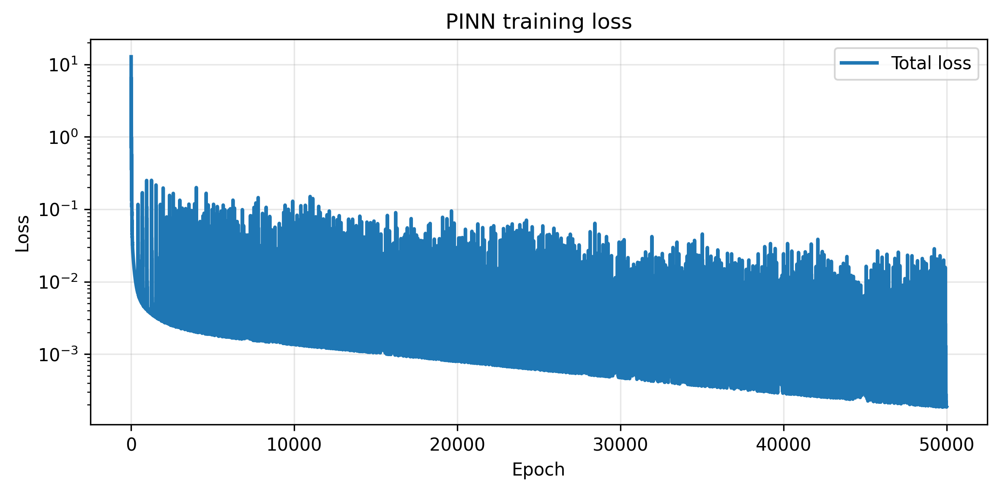

*Figure 13. Data-assisted PINN training loss. The total loss is higher than for the physics-only PINN because the objective now includes a strong supervised term. This is an important example of why loss magnitude alone is not a sufficient performance measure.*

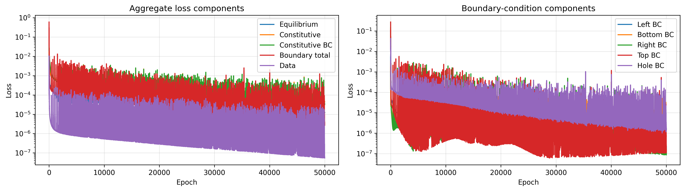

*Figure 14. Data-assisted PINN loss components. The presence of a non-zero data term changes the optimization balance. This does not weaken the PINN; instead, it aligns the optimization target more closely with the true displacement field.*

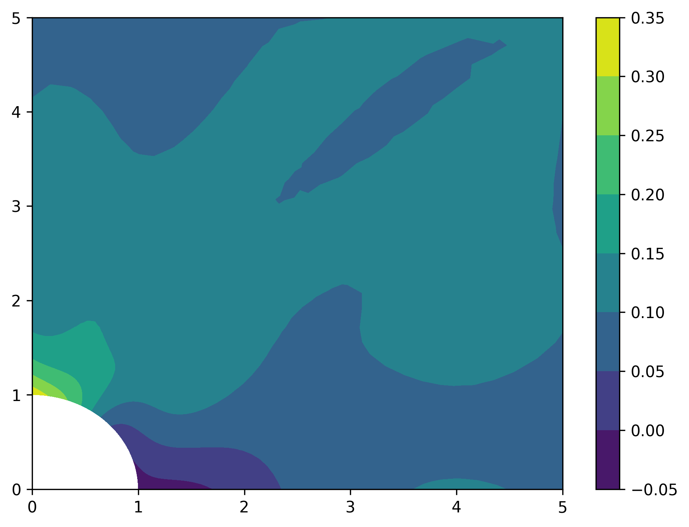

*Figure 15. Data-assisted PINN tensile stress field \(\sigma_{11}\). The concentration around the hole is now much more convincing, both visually and quantitatively. The stress field is smoother and better aligned with the expected high-stress region near the hole boundary.*

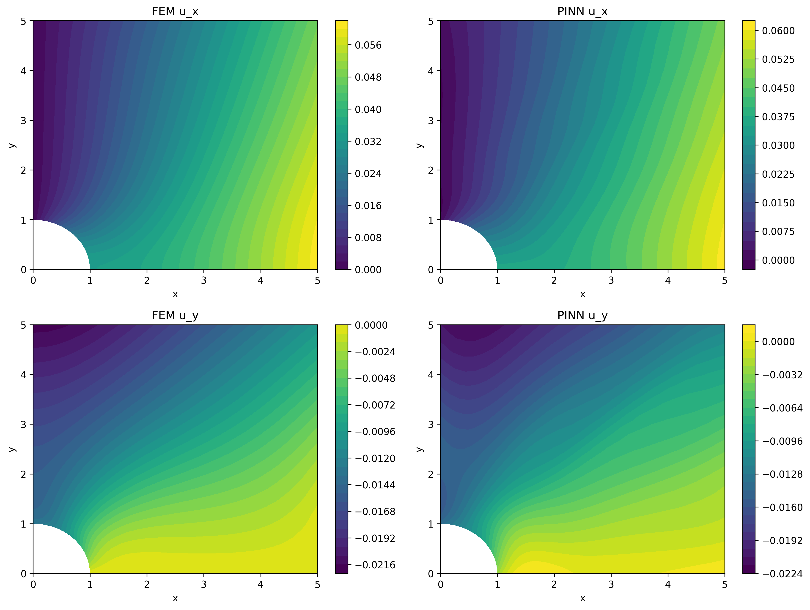

*Figure 16. Data-assisted FEM-vs-PINN displacement comparison. The visual mismatch is much smaller than in the physics-only case, and the error field becomes correspondingly weaker and more localized.*

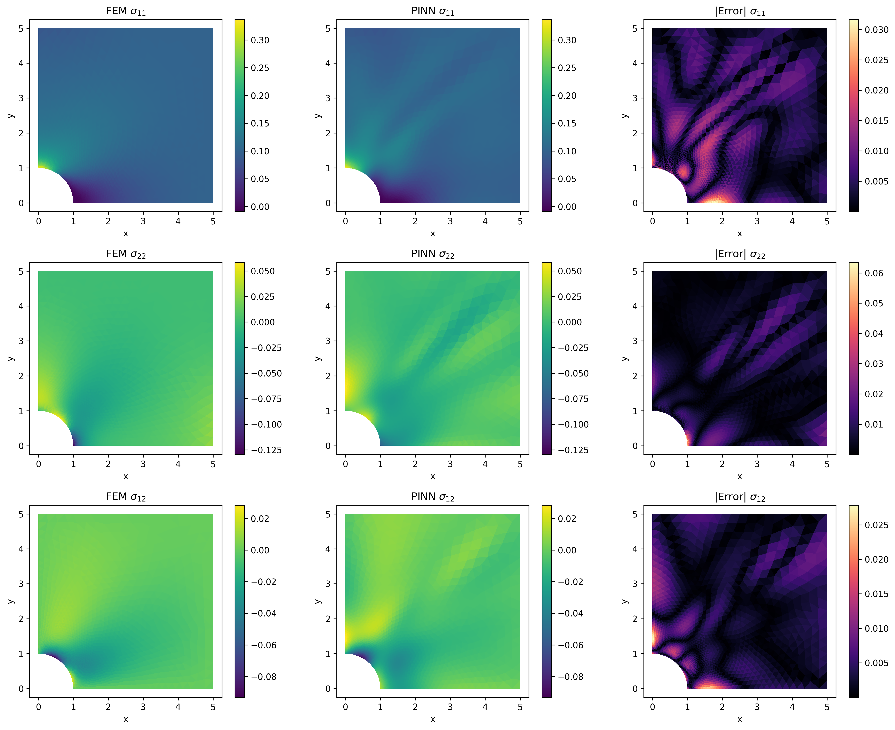

*Figure 17. Data-assisted FEM-vs-PINN stress comparison. The \(\sigma_{11}\) component is now captured well, while \(\sigma_{22}\) remains the most difficult component. This is still a large improvement over the physics-only case.*

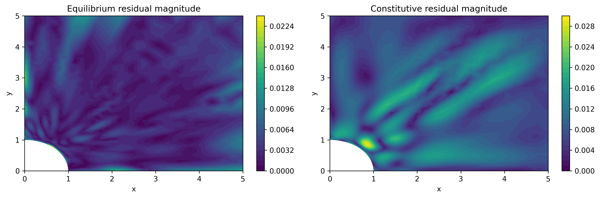

*Figure 18. Data-assisted residual spatial maps. Even after the addition of data, the most demanding regions remain near the hole boundary, but the overall residual magnitudes and the external FEM errors are much smaller.*

The main analytical point is that the addition of only 50 measurement points transformed the quality of the final solution. This happened because the extra supervised information anchored the displacement field and removed part of the ambiguity left by the residual-based objective alone. Once the displacement field became much more accurate, the constitutive relation yielded a substantially more accurate stress field as well. The fact that the total training loss is larger than in the physics-only case is therefore not a sign of a worse model. On the contrary, it shows that the optimization objective has become more demanding and more aligned with the actual reference solution.

### Problem 1 Discussion

Problem 1 demonstrates the difference between satisfying a PINN's internal objective and solving the physical problem accurately. The physics-only PINN reached an excellent residual loss but remained poor when checked against FEM. The data-assisted PINN, by contrast, produced far better agreement with the FEM displacement and stress fields even though its total training loss was larger.

This is an important result rather than a failure. The coursework hint explicitly notes that physics-only PINNs can perform unsatisfactorily and that measurement data can substantially improve convergence. The experiments here confirm exactly that behaviour. The final defensible result for Problem 1 is therefore the data-assisted PINN, not because it achieved the smallest raw training loss, but because it achieved the smallest physically meaningful error against the FEM reference.

The precision and device experiments also mattered. Float32/MPS was extremely useful during hyperparameter tuning because it accelerated proxy runs, but the float32-vs-float64 reruns showed that rankings and error magnitudes could change materially. For that reason, the final reported Problem 1 results were produced in float64 on CPU.

### Problem 1 Improvements

If more time and compute had been available, the following improvements would have been the most valuable:

- tune on budgets closer to the final `50k-100k` epoch regime rather than relying on short proxy runs,
- use a composite tuning objective that includes both displacement and stress accuracy rather than only displacement error,
- tune the relative weights of the loss terms more systematically,
- test a two-phase optimizer strategy such as Adam followed by L-BFGS,
- improve collocation and data-point sampling,
- strengthen the selection logic between best-loss, best-displacement, and best-stress checkpoints,
- include more systematic validation of local stress accuracy near the hole.

These points are discussed in more detail in [problem_1_improvements.md](problem_1_improvements.md), but the key message is that Problem 1 was already informative: the current workflow was sufficient to show both the limitations of the physics-only PINN and the benefits of adding small amounts of measured data.

### Problem 1 Conclusion

The plate-with-hole PINN results show that residual minimization alone was not enough to recover the FEM solution accurately, even after substantial tuning and very long training. Adding 50 displacement measurements fundamentally changed the quality of the solution, reducing both displacement and stress errors by large margins. The data-assisted PINN is therefore the defensible final result for Problem 1.

## Problem 2: Learning the Darcy Solution Operator

### Problem 2 Introduction

The second problem is a supervised operator-learning task: given a spatially varying diffusion coefficient field \(a(x)\), the objective is to learn the corresponding Darcy solution field \(u(x)\). Three model classes were studied:

- a simple encoder-decoder CNN,
- a U-Net,
- a Fourier Neural Operator.

Unlike Problem 1, the target solution is available directly in the dataset, so training and evaluation can be performed with standard supervised losses. The central question here is not only which model gives the lowest test loss, but also why the different architectures behave differently on this fixed-grid elliptic PDE dataset.

### Problem Setup and Data

The PDE is the two-dimensional Darcy flow equation on the unit square:

$$
-\nabla \cdot (a(x)\nabla u(x)) = f(x), \qquad x \in (0,1)^2,
$$

with homogeneous Dirichlet boundary condition

$$
u(x) = 0, \qquad x \in \partial (0,1)^2.
$$

The dataset consists of input coefficient fields \(a(x)\) and corresponding solution fields \(u(x)\), provided as MATLAB files for training and testing. During development, an internal validation split was taken from the provided training set for model selection. For the final runs, the selected hyperparameters were retrained on the full training data and evaluated on the provided test set. This separation ensured that the final reported test metrics were not used during the tuning stage.

### Model Architectures

#### Simple CNN

The simple CNN was implemented as a modest encoder-decoder architecture with pooling, batch normalization, and upsampling, but no skip connections. This made it a strong baseline rather than a deliberately weak toy model. The intuition was that the Darcy solution is a smooth spatial field defined on a fixed grid, so a convolutional model should already be able to capture much of the local structure.

#### U-Net

The U-Net used a similar encoder-decoder backbone but added skip connections from encoder blocks to decoder blocks. The motivation was that skip connections should preserve fine spatial information that may otherwise be lost during downsampling. For an elliptic PDE solution field, this is useful because the global structure is smooth, but local differences in the coefficient field still matter and can be blurred by a plain encoder-decoder.

#### Fourier Neural Operator

The FNO used spectral convolution layers that operate in Fourier space, together with pointwise linear layers. Conceptually, this makes the model well suited to operator learning because it can capture global interactions over the spatial domain more directly than a purely local convolutional architecture. In principle, this should be especially useful when the mapping from coefficient field to solution field depends on long-range structure as well as local variation.

### Hyperparameter Tuning Strategy

Problem 2 used manual grid search rather than Optuna. This was appropriate because the search spaces were modest and the supervised training setup was much cheaper than the PINN experiments.

The search space for the simple CNN and the U-Net was:

| Hyperparameter | Search space |
|---|---|
| `base_channels` | 16, 32 |
| `learning_rate` | \(10^{-3}\), \(5\times10^{-4}\) |
| `weight_decay` | 0, \(10^{-6}\) |

The search space for the FNO was:

| Hyperparameter | Search space |
|---|---|
| `modes` | 8, 12 |
| `width` | 24, 32 |
| `learning_rate` | \(10^{-3}\), \(5\times10^{-4}\) |

The selected final settings were:

- **Simple CNN**: `base_channels = 32`, `learning_rate = 1e-3`, `weight_decay = 1e-6`,
- **U-Net**: `base_channels = 32`, `learning_rate = 1e-3`, `weight_decay = 1e-6`,
- **FNO**: `modes = 8`, `width = 32`, `learning_rate = 5e-4`, `weight_decay = 1e-6`.

Unlike Problem 1, there was no Optuna-based search here. The tuning process was instead deliberately simple and transparent: try a small grid, choose the lowest validation loss, and then retrain the selected configuration on the full training set for the final report run.

### Final Quantitative Comparison

The canonical final results are summarized below.

| Model | Epochs | Device | Parameters | Training time | Final test loss |
|---|---:|---|---:|---:|---:|
| Simple CNN | 300 | MPS | 426,177 | 0:06:31 | 0.005034 |
| U-Net | 400 | MPS | 472,257 | 0:06:45 | 0.002994 |
| FNO | 500 | CPU | 541,441 | 0:50:54 | 0.000772 |

The U-Net improved on the simple CNN by about **40.5%** in test loss. The CPU FNO improved on the U-Net by about **74.2%**, and on the simple CNN by about **84.7%**.

However, this table is incomplete without the backend comparison:

| FNO run | Device | Final test loss |
|---|---|---:|
| Final canonical FNO | CPU | 0.000772 |
| Comparison FNO run | MPS | 0.039111 |

This gap is so large that it materially changes the interpretation of the architecture comparison. Without the CPU rerun, the FNO would have looked much worse than the CNNs. With the CPU rerun, it was the best model by a wide margin.

### Graphical Analysis of the Darcy Predictions

#### Simple CNN

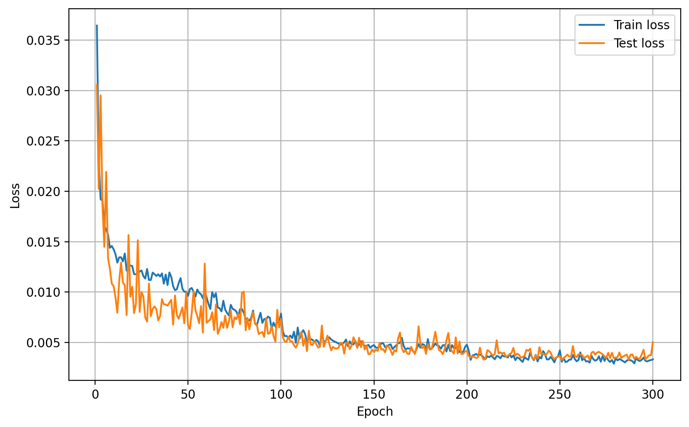

*Figure 19. Simple CNN train/test loss curve. The loss decreases smoothly and the final test performance is already strong, which confirms that a relatively conventional convolutional architecture is a competitive baseline on this fixed-grid Darcy dataset.*

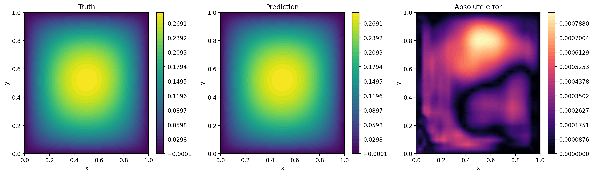

*Figure 20. Simple CNN truth, prediction, and error for a test sample. The prediction captures the broad structure of the Darcy solution well, but the error map indicates that some local detail is smoothed out. This is consistent with the architecture: the model has enough capacity to learn the global field, but no skip connections to help preserve fine-scale structure during encoding and decoding.*

The simple CNN performed better than might be expected for a baseline. This is not surprising in a fixed-resolution image-to-image setting: convolutional inductive bias is already very well matched to smooth elliptic PDE solution fields on structured grids.

#### U-Net

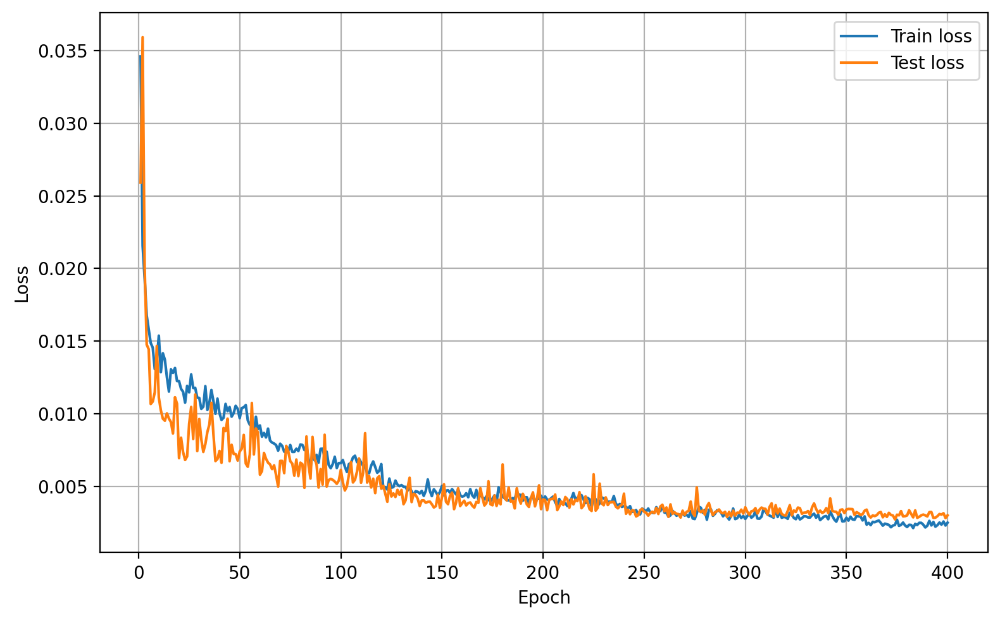

*Figure 21. U-Net train/test loss curve. The U-Net converges to a lower test loss than the simple CNN while retaining a similarly stable training profile.*

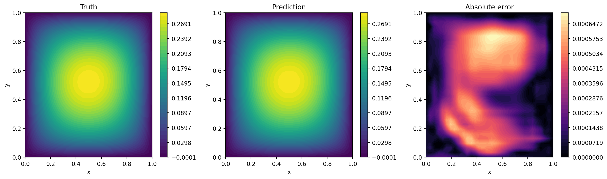

*Figure 22. U-Net truth, prediction, and error for a test sample. The prediction follows the target field more closely than the simple CNN, and the error becomes smaller and more localized. This is consistent with the role of skip connections, which help preserve multiscale spatial information that a plain encoder-decoder can lose.*

The U-Net therefore behaved exactly as hoped: it retained the strengths of a convolutional architecture while improving local fidelity through skip connections. The relatively small increase in parameter count was enough to produce a meaningful reduction in test loss.

#### FNO

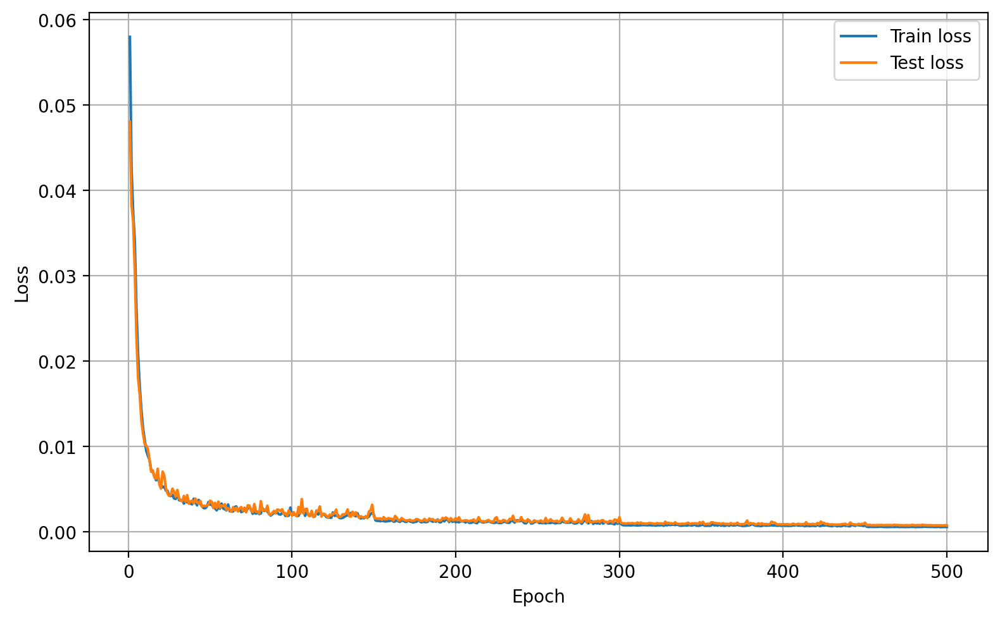

*Figure 23. CPU FNO train/test loss curve. The loss decreases to a much lower level than either CNN-based model, confirming that the final CPU FNO run was materially stronger than the convolutional baselines.*

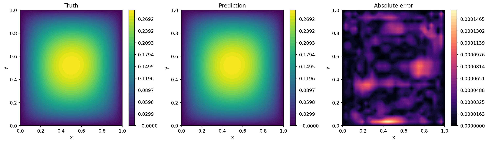

*Figure 24. CPU FNO truth, prediction, and error for a test sample. The predicted field is extremely close to the truth, and the residual error is much smaller and more uniform than in the CNN-based models. This is the strongest qualitative evidence that the FNO captured the solution operator most accurately once trained on a reliable backend.*

For the FNO, the graphical evidence supports the quantitative results. The prediction tracks the true field closely across the domain, and the absolute error map is much weaker than for the simple CNN or U-Net. This suggests that the FNO captured both the global structure and the fine spatial variations of the Darcy solution operator more effectively than the purely convolutional models.

### Backend Sensitivity and Numerical Reliability of the FNO

The FNO required special discussion because the initial MPS-based final run gave unexpectedly poor results and also produced FFT-related warnings during training. Since spectral convolutions rely directly on FFT operations, this raised the possibility that the hardware/backend rather than the architecture itself was responsible for the weak performance.

The same final FNO hyperparameters were therefore rerun on CPU. The outcome changed dramatically:

- MPS final test loss: **0.03911**
- CPU final test loss: **0.000772**

This is an improvement of about **98.0%** in test loss. The CPU run took longer, but it transformed the ranking of the models.

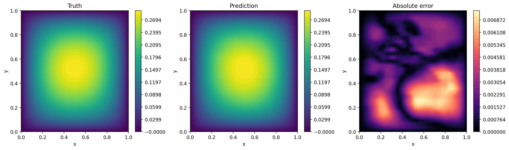

*Figure 25. MPS FNO truth, prediction, and error for the same architecture and hyperparameters. The much weaker prediction quality here is evidence that the poor MPS FNO result should not be interpreted as an architectural failure.*

This result is important because it demonstrates good scientific practice. If the first FNO run had simply been accepted, the report would have concluded that the FNO underperformed the CNNs. The backend check showed that this conclusion would have been wrong. The correct conclusion is that the FNO architecture was strong, but the MPS FFT path was not reliable enough for this final configuration.

### Problem 2 Discussion

Problem 2 produced a clear ordering once the FNO backend issue was resolved:

1. simple CNN: strong baseline,
2. U-Net: better multiscale convolutional model,
3. CPU FNO: best overall operator-learning model.

This ordering makes sense. The U-Net outperformed the simple CNN because skip connections preserved information lost during the encoding stage. The FNO outperformed both because its spectral layers are better suited to learning a global operator mapping on a structured grid. At the same time, the strong performance of the simple CNN and U-Net should not be dismissed. On a fixed `32x32` grid with paired supervised data, convolutional image-to-image models are a natural and effective baseline.

The main caveat is that the FNO result was backend-sensitive. This does not weaken the report; instead, it strengthens it because the final comparison was validated rather than taken at face value.

### Problem 2 Improvements

If more time were available, the most useful improvements for Problem 2 would be:

- run larger hyperparameter searches, especially for the FNO on CPU,
- tune epoch budgets more systematically so that all models are compared after clearly converged training,
- expand the FNO search beyond only `modes` and `width`,
- perform architecture ablations, such as removing skip connections from the U-Net or varying CNN depth,
- report more than one qualitative test sample in the main text,
- compute additional error summaries beyond relative \(L_2\),
- validate backend reliability earlier, especially for FFT-heavy models.

These are discussed at greater length in [problem_2_improvements.md](problem_2_improvements.md). The most important practical lesson is that backend validation should have been performed earlier for the FNO, since it ultimately changed the interpretation of the final model ranking.

### Problem 2 Conclusion

Problem 2 showed that convolutional models are already very effective for the Darcy operator-learning task, with the U-Net improving meaningfully on a strong simple CNN baseline. Once backend issues were handled correctly, the FNO performed best overall. The final comparison is therefore not "CNN good, FNO bad", but rather "CNNs are strong baselines, and FNO is strongest when trained on a reliable backend".

## Overall Conclusion

Across both problems, the most important lesson was that internal optimization success is not the same as trustworthy scientific performance. In Problem 1, the physics-only PINN reached very low residual loss while still failing to match the FEM reference accurately. Adding only 50 displacement measurements transformed the solution quality. In Problem 2, the model ranking changed completely once the FNO was rerun on CPU rather than MPS.

The broader conclusion is that data-driven PDE methods must be judged using a combination of:

- physically meaningful validation metrics,
- careful graphical analysis,
- appropriate tuning strategies,
- and awareness of numerical issues such as precision and backend behaviour.

That combination was essential to obtaining defensible final results in both coursework problems.

## Appendix A: Additional Problem 1 Tuning Figures

The following plots were produced during the Optuna studies and are useful supplementary material if more tuning detail is desired in the final PDF:

- [Baseline contour plot](problem_1_experiments/optuna_studies/pinn_v4_baseline/figures/contour.png)
- [Baseline EDF plot](problem_1_experiments/optuna_studies/pinn_v4_baseline/figures/edf.png)
- [Baseline intermediate values](problem_1_experiments/optuna_studies/pinn_v4_baseline/figures/intermediate_values.png)
- [Baseline timeline](problem_1_experiments/optuna_studies/pinn_v4_baseline/figures/timeline.png)
- [Part (e) contour plot](problem_1_experiments/optuna_studies/pinn_v4_part_e/figures/contour.png)
- [Part (e) EDF plot](problem_1_experiments/optuna_studies/pinn_v4_part_e/figures/edf.png)
- [Part (e) intermediate values](problem_1_experiments/optuna_studies/pinn_v4_part_e/figures/intermediate_values.png)
- [Part (e) timeline](problem_1_experiments/optuna_studies/pinn_v4_part_e/figures/timeline.png)

These are not all needed in the main body, but they are useful if the final report needs more evidence for the tuning discussion.

## Appendix B: Canonical Figure Sources

### Problem 1

- No-data PINN figures: `problem_1_figures/problem1_20260315_165315_full_nodata_seed1234/`
- Data-assisted PINN figures: `problem_1_figures/problem1_20260315_203703_full_data_seed1234/`

### Problem 2

- Simple CNN final figures: `problem_2_outputs/darcy_cnn_simple/20260316_114818_single_final/figures/`
- U-Net final figures: `problem_2_outputs/darcy_cnn_unet/20260316_115014_single_final/figures/`
- FNO CPU final figures: `problem_2_outputs/darcy_fno/20260316_124531_single_final/figures/`
- FNO MPS comparison figures: `problem_2_outputs/darcy_fno/20260316_122017_single_final/figures/`
